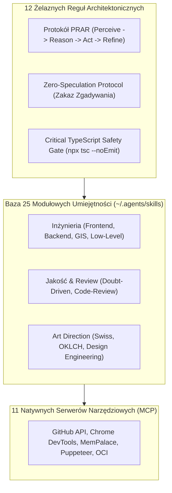
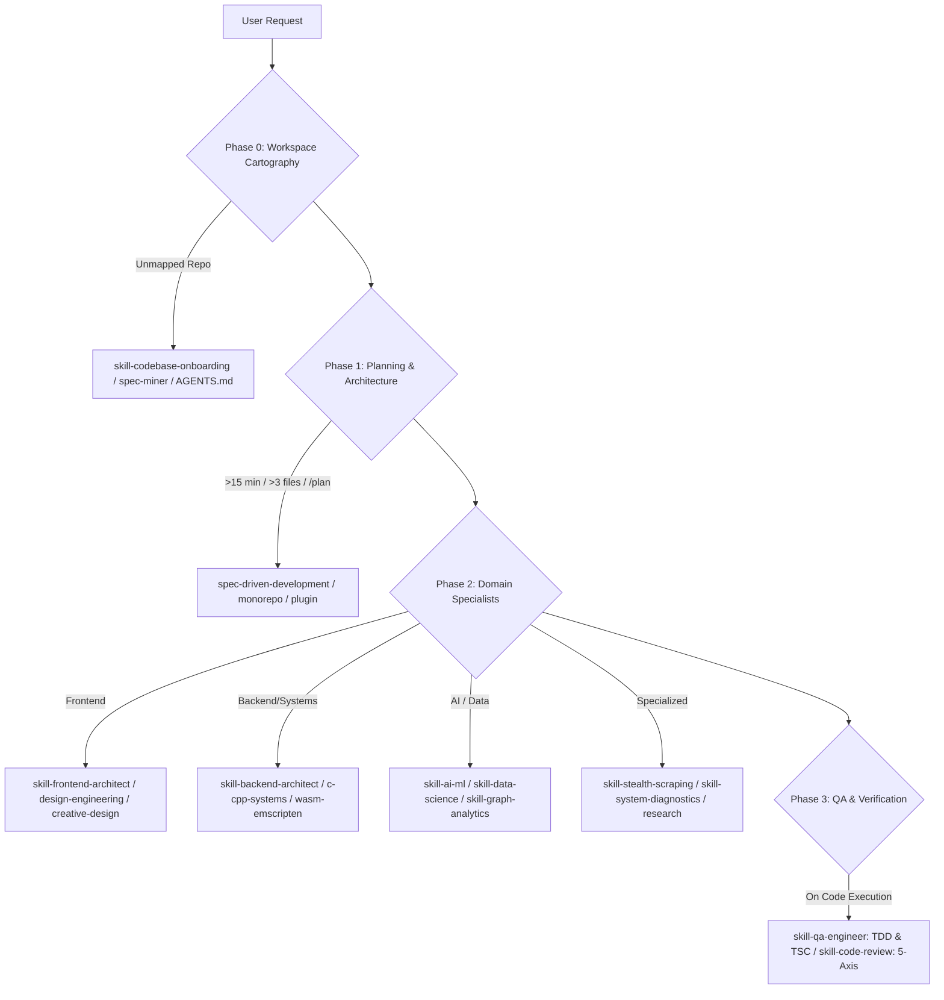

# Multi-Platform Agentic AI Engineering Operating System & Skill Suite

> Production-ready, cross-platform configuration framework, system rules (Prime Directives), 33 modular skills (`agentskills.io` standard), repository blueprints (`AGENTS.md`), and Model Context Protocol (MCP) configurations for **OpenAI Codex**, **Antigravity / Gemini CLI**, **Claude Code**, and **Modern Cursor IDE (.mdc)** across **Windows**, **macOS**, and **Linux**.

---

##  1-Prompt Autonomous AI Installation

If you are using an AI coding assistant (Claude Code, OpenAI Codex, Cursor Composer, Gemini CLI, Cline, Roo Code, OpenCode, Aider), simply paste this prompt:

### English:
```text
Clone https://github.com/Gzyms69/agent-setup-bundle.git and install the full AI engineering operating system for me following AGENTS.md in the repo.
```

### Polski:
```text
Sklonuj https://github.com/Gzyms69/agent-setup-bundle.git i zainstaluj całe środowisko inżynieryjne według instrukcji w AGENTS.md.
```

Your AI assistant will read [AGENTS.md](AGENTS.md), auto-detect your operating system (Windows, macOS, or Linux), run the appropriate native installer, validate suite integrity, and immediately adopt the **Senior AI Pair Programmer** persona.

---

## 1. Executive Summary & Philosophy

Traditional approaches to AI pair programming ("Just write this feature") fail consistently on non-trivial codebases due to four core traps:
1. **Simulation & Mocking Traps:** Writing fake stubs or untested boilerplate without running verification suites.
2. **Context Window Flooding:** Inefficiently dumping thousands of prompt lines instead of on-demand skill discovery.
3. **Monolithic Spaghetti Code:** Creating giant "god files" (>150 lines) that mix state, presentation, networking, and styles.
4. **Hardware & Version Hallucinations:** Speculating about hardware capabilities, compiler flags, or package versions without live verification.

**`agent-setup-bundle`** solves this by establishing a deterministic, multi-platform engineering operating system across all major coding assistants.



---

## 2. Core Engineering Mandates (The Laws of Robotics)

Every agent configured with this suite strictly adheres to the following non-negotiable protocols:

1. **PRAR Workflow (Perceive, Reason, Act, Refine):**
   - Agents never write code blindly. Every task begins with environmental analysis (Perceive), architectural design (Reason), surgical modifications (Act), and verification (Refine).
2. **Mandatory 4-Phase Pre-Flight Skill Gate:**
   - Before executing file discovery (`grep`, `find`, `cat`) or modifying code, agents must evaluate and load domain skills in a strict 4-phase sequence.
3. **The Wait-For-GO Mandate:**
   - On tasks requiring architectural decisions, touching >3 files, or introducing new dependencies, agents must present a detailed implementation plan and wait for an explicit user approval ("GO") before mutating files.
4. **Zero Speculation Protocol:**
   - Total ban on guessing hardware specs, software versions, API endpoints, error causes, or compiler flags. Technical facts must be verified using live terminal commands or documentation lookup.
5. **Root Cause Only & Anti-Workaround:**
   - Ban on temporary workarounds, path symlinks, or defensive `try/catch` wrappers that mask failures. Bugs must be resolved at the lowest architectural layer (`Kernel > Driver > OS Config > Runtime > Framework > Application Code`).
6. **Critical TypeScript Safety Gate:**
   - After modifying any `.ts`/`.tsx` file, agents must run `npx tsc --noEmit`. Deleting business logic to bypass type errors is strictly forbidden.
7. **Single Source of Truth (SSOT) & Anti-Duplication:**
   - Duplicate helpers, parallel endpoints, or competing schemas are forbidden. Existing implementations must be reused or refactored in-place.
8. **Anti-Destruction Protocol:**
   - Strict ban on `git clean`, blind mass search-and-replace, or destructive workspace operations without explicit user confirmation.

---

## 3. The 4-Phase Pre-Flight Skill Gate

To prevent context window bloat and eliminate architectural guessing, skills are activated through a gated hierarchy:

```
[Level 0: Metadata & Cartography] ──→ [Level 1: Planning & Spec] ──→ [Level 2: Domain Specialists]
                                                                                │
                                      [Level 3: QA & Verification Gate] ◀───────┘
```



---

## 4. Project-Level Configuration Standard (`AGENTS.md`)

Global rules in `~/.agents/` define **agent behavior**, but individual repositories require **project-level context**.

This bundle provides the standardized [templates/AGENTS.md](templates/AGENTS.md) blueprint based on the Agentic AI Foundation (AAIF) specification.

### How to use `AGENTS.md` in your projects:
1. Copy the blueprint to your project root:
   - **Linux / macOS:** `cp ~/.agents/templates/AGENTS.md ~/Dev/MyProject/AGENTS.md`
   - **Windows:** `Copy-Item $env:USERPROFILE\.agents\templates\AGENTS.md C:\Dev\MyProject\AGENTS.md`
2. Fill in the 4 core sections:
   - **Project Identity & Stack Architecture:** Language, runtime, framework versions, database ORM, styling system.
   - **Mandatory Commands (Executable Truth):** Exact commands with flags for `install`, `dev`, `build`, `test`, `tsc`, and `lint` (agents will NEVER guess CLI flags).
   - **Directory Topography & Module Boundaries:** Explicit directory layout and boundaries (e.g. `src/domain/`, `src/adapters/`, `src/components/`).
   - **Invariants & Guardrails (Never-Do Rules):** Strict project invariants (e.g. "Never import DB models in client components", "Files must remain under 150 lines").

When OpenAI Codex, Claude Code, Gemini CLI, or Cursor opens your project, it reads `AGENTS.md` as the primary Source of Truth.

---

## 5. 16 Operational Core Rules (`~/.agents/rules/`)

| Rule | File | Purpose & Key Mandate |
|---|---|---|
| **Skill Orchestration** | `skill-orchestration.md` | Mandates the 4-Phase Pre-Flight Skill Gate before file discovery or code modifications. |
| **Planning & Document Integrity** | `planning-and-document-integrity.md` | Multi-turn `/plan` lifecycle, `Iteration Delta`, Discovered Facts Lock, and Active SSOT (anti-zombie context). |
| **Context Engineering** | `context-engineering.md` | Attention budget preservation, scratchpad offloading (>100 lines/5KB), and context poisoning circuit breaker. |
| **Zero Speculation** | `zero-speculation.md` | Total ban on guessing versions, APIs, or system specs without live diagnostic verification. |
| **Modular Architecture** | `modular-architecture.md` | Anti-Monolith constraint (max ~150-200 lines), Clean/Hexagonal boundaries, typed contracts. |
| **Systemic Excellence** | `systemic-excellence.md` | Anti-workaround protocol, root-cause fixes, DRY, and Single Source of Truth (SSOT). |
| **System Identity** | `system-identity.md` | Hardware & OS baseline template with auto-discovery commands to prevent hallucinations. |
| **Command Verification** | `command-verification.md` | Mandatory secondary read-only check after any state-modifying command. |
| **Subagent Economy** | `subagent-economy.md` | Dynamic LLM model tiering, Zero Context Bleed mandate, workspace isolation, and barrier sync. |
| **Problem Isolation** | `problem-isolation.md` | Strict scope containment; zero unrequested refactors or global OS alterations. |
| **Environment Integrity** | `env-integrity.md` | Sanity checks on workspace, lockfiles, and dependencies before modifying files. |
| **Error Triage** | `error-triage.md` | Deterministic diagnostic priority order: Documentation -> Web Search -> Code Inspection. |
| **Full Log Reporting** | `full-log-reporting.md` | Ban on truncated, summarized, or paraphrased error reporting. |
| **MemPalace Discovery** | `mempalace-discovery.md` | Absolute priority of MemPalace memory retrieval before broad filesystem searches. |
| **MCP Master Playbook** | `mcp-master-playbook.md` | 11-server MCP execution matrix, permission boundaries, and synergy workflows. |
| **Session Handoff** | `session-handoff.md` | Lossless context transfer, Lean SSOT enforcement, and standardized bootstrap prompts. |

---

## 6. 36 Production-Grade Skills (`~/.agents/skills/`)

All skills adhere to the `agentskills.io` standard with YAML frontmatter, progressive disclosure, and anti-rationalization verification gates:

### Domain A: Cartography, Planning, Context & Orchestration (7 Skills)
- **`skill-codebase-onboarding`**: Systematic 5-phase repository cartography, entrypoint discovery, and command extraction.
- **`spec-miner`**: Reverse-engineering engine for extracting specifications and dataflows from legacy/undocumented code.
- **`spec-driven-development`**: Gated SDLC workflow (Specify -> Plan -> Tasks -> Implement) with verification matrices.
- **`skill-context-engineering`**: Production context engineering, Attention U-Curve defense, Anchored Iterative Summarization, and Artifact Trail tracking.
- **`skill-master-orchestrator`**: Master agent orchestration, multi-agent swarm coordination, Task DAG decomposition, and model economy routing.
- **`skill-monorepo-architect`**: Polyglot monorepo management (`uv` Python workspaces, `pnpm` workspaces, Turborepo).
- **`skill-plugin-architecture`**: Microkernel architecture, dynamic plugin discovery, lifecycle hooks, and error boundaries.

### Domain B: Frontend & UI/UX Craftsmanship (5 Skills)
- **`skill-frontend-architect`**: Next.js 15+ App Router, React Server Components (RSC), Client Island boundaries, WCAG 2.2 AA.
- **`skill-design-engineering`**: Creative frontend engineering, Motion.dev spring animations, CSS Subgrid, Container Queries, 21st.dev UI components.
- **`skill-creative-design`**: Art direction, Swiss/Bauhaus aesthetics, Fontjoy typography math, and OKLCH color physics.
- **`skill-web-performance`**: Core Web Vitals optimization (LCP, INP, CLS), Lighthouse 100/100 audits, and runtime tracing.
- **`seo-optimization-and-audit`**: Search engine ranking optimization, structured metadata, semantic HTML, and head audits.

### Domain C: Backend, Systems & MCP (8 Skills)
- **`skill-backend-architect`**: Contract-first API design, database schemas, query optimization (`EXPLAIN ANALYZE`), indexing, and Expand/Contract migrations.
- **`skill-mcp-builder`**: Architecture, implementation, and debugging of Model Context Protocol (MCP) servers (FastMCP, TypeScript SDK, stdio/SSE).
- **`skill-web-architecture`**: Full-stack architectural standards, module boundaries, and end-to-end API contracts.
- **`c-cpp-systems`**: Memory safety, struct packing (`#pragma pack`), manual RAII, bitwise math, and sanitizers (`ASan`/`UBSan`).
- **`skill-low-level-programming`**: Low-level systems programming, Assembly, byte manipulation, memory layout, and endianness handling.
- **`wasm-emscripten`**: WebAssembly compilation via Emscripten, `ccall`/`cwrap` FFI bindings, virtual FS, and HEAP views.
- **`retro-emulation-engineering`**: Retro hardware simulation (CPU/RSP/RDP), frame timing, dynamic audio resampling, and ROM validation.
- **`skill-emulator-wasm`**: WebAssembly retro emulation engineering, Emscripten bridge lifecycle, WebGL rendering, and cartridge saves.

### Domain D: AI, Data Science & Intelligence (7 Skills)
- **`skill-ai-ml`**: LLM model integrations, embeddings, vector databases (Redis, ChromaDB), and agentic workflows.
- **`skill-data-science`**: Data ingestion pipelines, exploratory data analysis (EDA), dataframes (Polars/Pandas), and validation.
- **`skill-data-analysis`**: Statistical analysis, hypothesis testing, anomaly detection, and scientific claim verification.
- **`skill-graph-analytics`**: Graph databases (Neo4j), Cypher queries, topology analysis, and Graph Data Science (GDS).
- **`skill-stealth-scraping`**: Anti-bot evasion (Cloudflare/DataDome), TLS fingerprint spoofing, and browser automation.
- **`skill-osint-engineering`**: Open Source Intelligence gathering, Pydantic entity graphs, pivoting engines, and OPSEC.
- **`skill-research`**: Academic and technical literature research, arXiv paper analysis, and multi-source fact checking.

### Domain E: QA, Systems Diagnostics & Conversion (9 Skills)
- **`skill-qa-engineer`**: Test-Driven Development (TDD Red-Green), TypeScript compilation safety gates (`npx tsc --noEmit`).
- **`skill-code-review`**: Systematic 5-axis code review (Correctness, Readability, Architecture, Security OWASP Top 10, Performance).
- **`doubt-driven-development`**: Adversarial verification gate to challenge false confidence and prevent silent failures.
- **`skill-system-diagnostics`**: Hardware, OS, driver, kernel panic diagnostics, and log analysis.
- **`skill-devops-cloud`**: Docker containers, Docker MCP inspection, CI/CD pipelines, and cloud deployments.
- **`skill-resume-tailor`**: ATS-optimized resume, CV, and cover letter tailoring following the Google XYZ formula.
- **`marketing-copywriting`**: Conversion-focused technical copywriting and value proposition design.
- **`avoid-ai-writing`**: Detection and elimination of AI writing clichés, robotic cadence, and filler words.
- **`mempalace` / `mempalace-recall`**: Long-term memory palace management and historical knowledge retrieval.

---

## 7. Cross-Platform Quickstart & Installation

Clone and run the installer for your operating system:

```bash
git clone https://github.com/Gzyms69/agent-setup-bundle.git
cd agent-setup-bundle
```

### Option A: Windows (PowerShell)
```powershell
Set-ExecutionPolicy -Scope Process -ExecutionPolicy Bypass
.\install.ps1 -All
```
*Platform options:* `.\install.ps1 -Codex`, `.\install.ps1 -Gemini`, `.\install.ps1 -Claude`, `.\install.ps1 -Cursor`

### Option B: Linux & macOS (Bash / zsh)
```bash
chmod +x install.sh
./install.sh --all
```
*Platform options:* `./install.sh --codex`, `./install.sh --gemini`, `./install.sh --claude`, `./install.sh --cursor`

### Option C: Universal Python Installer (Any OS)
```bash
python install.py --all
```
*Platform options:* `python install.py --codex`, `python install.py --gemini`, `python install.py --claude`, `python install.py --cursor`

---

## 8. Supported Environments & Platform Matrix

| Platform | Manifest / Rule Location | Config Location | Skill Discovery Path |
|---|---|---|---|
| **OpenAI Codex** | `~/.codex/AGENTS.md` & `instructions.md` | `~/.codex/config.toml` | `~/.codex/skills/custom` -> `~/.agents/skills` |
| **Antigravity / Gemini CLI** | `~/.gemini/GEMINI.md` | `~/.gemini/settings.json` | `~/.agents/skills/` |
| **Claude Code** | `~/.claude/CLAUDE.md` + `.claude/agents/` | `~/.claude/mcp.json` | `~/.claude/skills` -> `~/.agents/skills` |
| **Cursor IDE** | `~/.cursor/rules/*.mdc` | `~/.cursor/mcp.json` | On-demand referencing |

---

## 9. Repository File Structure

```
agent_setup_bundle/
├── AGENTS.md                        # Master repository blueprint & AI installer instructions
├── README.md                        # Master technical documentation & cross-platform guide
├── PROMPT_FOR_AI.md                 # Universal bootstrap prompts
├── llms.txt                         # Semantic summary for web-enabled LLM agents
├── install.sh                       # Native Bash installer (Linux / macOS)
├── install.ps1                      # Native PowerShell installer (Windows)
├── install.py                       # Universal Python 3 installer (All OSes)
├── core/                            # Platform manifests (CODEX.md, GEMINI.md, CLAUDE.md, cursor)
├── rules/                           # 16 Universal Rules (~/.agents/rules/)
├── skills/                          # 36 Modular Skills (~/.agents/skills/)
├── templates/
│   └── AGENTS.md                    # Project-level starter template
├── config/                          # Configuration & MCP templates (codex, gemini, cursor)
├── policies/                        # MCP tool planning policies
└── scripts/
    └── validate_suite.py            # Quality assurance test suite
```

---

## 10. License

This project is licensed under the [MIT License](LICENSE).
