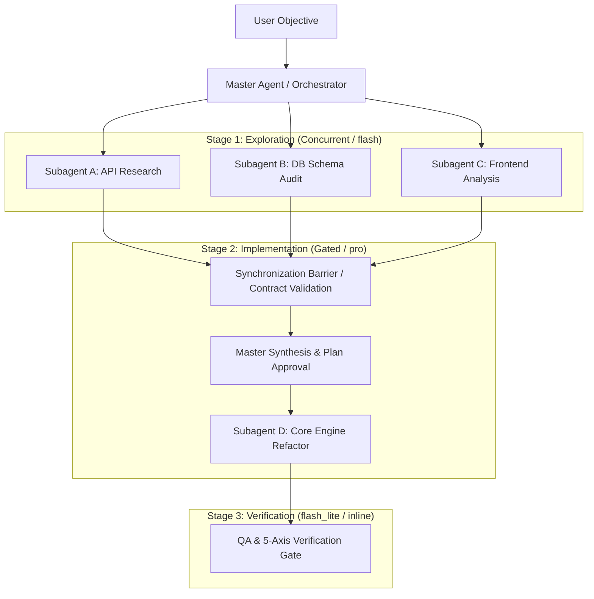

# Master Orchestrator Skill

This skill defines the operational standards for orchestrating multi-agent systems, decomposing complex workflows into Directed Acyclic Graphs (DAGs), enforcing subagent context isolation, and preventing coordination overhead.

The primary purpose of subagents is **context isolation and token budgeting**, not organizational role-play.

---

## When to Activate

Activate this skill when:
- Tasks naturally decompose into independent parallel subtasks (e.g., parallel file audits, multiple search queries).
- A single task touches multiple disjoint subsystems where isolated contexts prevent cognitive pollution.
- Running long-horizon refactors requiring strict division between exploration, implementation, and QA.
- Coordinating roju subagents via `invoke_subagent` and `send_message`.

Do NOT activate for:
- Simple sequential tasks requiring fewer than 3 tool calls (do them inline).
- Routine single-file edits.

---

## 1. Task DAG (Directed Acyclic Graph) Decomposition

Never spawn subagents haphazardly. Model workflows as a deterministic DAG of parallel and sequential stages:



### DAG Rules:
1. **Parallel Branches:** Spawn concurrent subagents ONLY for tasks with zero data dependencies between them.
2. **Synchronization Barriers:** Whenever a downstream step depends on upstream outputs, the Master Agent MUST pause, validate all incoming contracts, and synthesize the consolidated state before launching the next phase.

---

## 2. Subagent Model Routing & Token Economy

Strictly enforce the model tiers defined in `rules/subagent-economy.md`:

| Task Category | Model Tier | Rationale |
| :--- | :--- | :--- |
| **File I/O & Cartography** | `flash_lite` | Fast, cheap directory traversal and SKILL.md reading. |
| **Web Research & Diffs** | `flash` | High throughput, accurate factual retrieval without heavy reasoning cost. |
| **Complex Multi-File Plan** | `pro` | Deep reasoning for architectural specs and safety-critical logic. |
| **Parent Continuation** | `inherit` | Preserves the parent agent's reasoning profile when delegating. |

---

## 3. Subagent Task Contract Template

When delegating a task to a subagent via `invoke_subagent`, the prompt MUST follow this strict contract structure:

```markdown
### Task Delegation Contract: [Task Name]

#### 1. Objective
[Unambiguous statement of the specific problem to solve]

#### 2. Scope & Constraints
- Target Files: `[list of absolute paths]`
- Allowed Operations: `[Read-Only | Create | Modify]`
- Model Tier: `[flash_lite | flash | pro | inherit]`
- Workspace Mode: `[inherit | share | branch]`

#### 3. Expected Output Schema (Zero Context Bleed)
Return your final output in this exact markdown shape:
- Status: `[SUCCESS | FAILED | BLOCKED]`
- Summary: `[3-5 bullet points of findings/changes]`
- Artifacts: `[Full paths of created/modified files]`
- Blocker/Risks: `[Any discovered edge cases or none]`
```

---

## 4. Prevention of the "Telephone Game"

Supervisor architectures often lose 30-50% fidelity when intermediate agents summarize specialist outputs repeatedly.

### Direct Synthesis Protocol:
1. When a subagent produces a complete, high-fidelity report or artifact (e.g. an exhaustive research document or test log), the Master Agent should present or link the artifact directly to the user.
2. Do not distort exact error codes, file paths, or line numbers through lossy re-phrasing.

---

## 5. Watchdog & Deadlock Prevention

1. **No Polling Loops:** Antigravity reactive wakeups trigger automatically when subagents complete or send messages. Never write sleep/polling loops.
2. **Lifecycle Termination:** Immediately terminate subagents that have completed their turn using `manage_subagents kill` to free runtime resources.
3. **Error Boundaries:** If a subagent encounters a fatal error, contain the failure at the Master level. Do not let one subagent failure crash sibling tasks.

---

## 6. Anti-Rationalization Table

| Agent Excuse | BLOCKED Rebuttal |
| :--- | :--- |
| *"I will spawn 8 subagents to check every folder."* | **BLOCKED:** Violates the concurrency limit (max 3) and causes massive token explosion. Batch inspections. |
| *"I'll use `pro` model for all subagents to ensure quality."* | **BLOCKED:** Violates Subagent Economy. Use `flash_lite` for reads and `flash` for research. |
| *"I'll let subagents modify the same root files concurrently."* | **BLOCKED:** Causes dirty write conflicts. Use workspace isolation and sequential barriers. |

---

## 7. Verification Gates

- [ ] Is the multi-agent workflow organized into a clear DAG with synchronization barriers?
- [ ] Are all subagents assigned the cheapest adequate model tier?
- [ ] Are subagent prompts structured with the 3-section Task Contract?
- [ ] Are completed subagents terminated promptly with `manage_subagents kill`?
